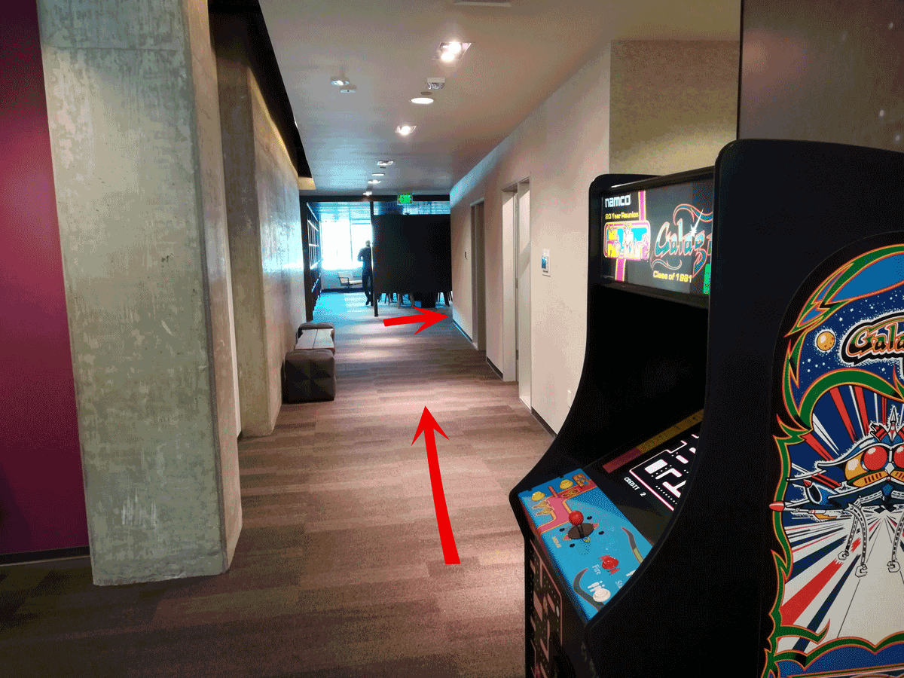
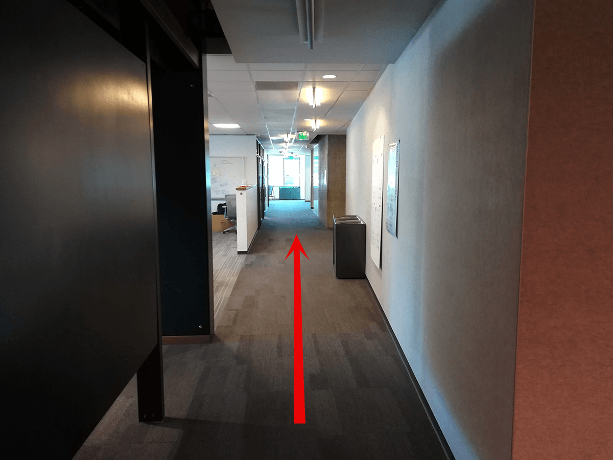
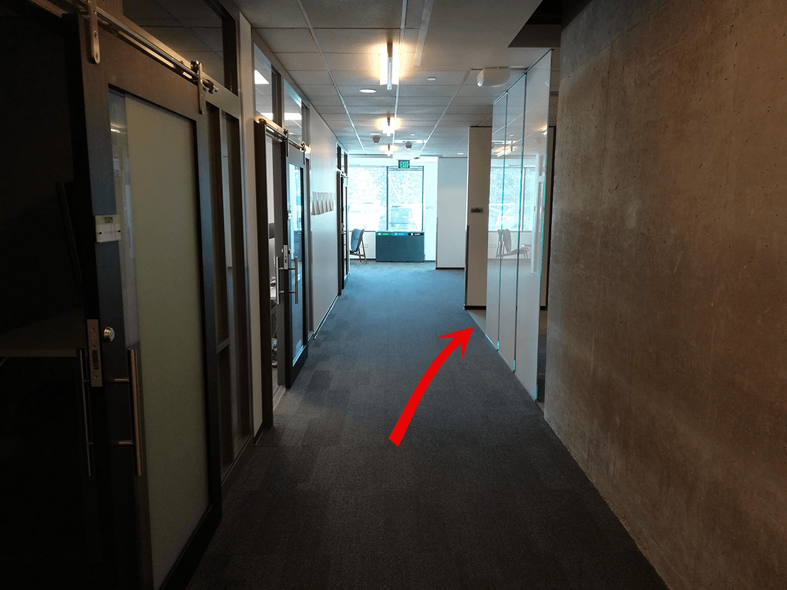
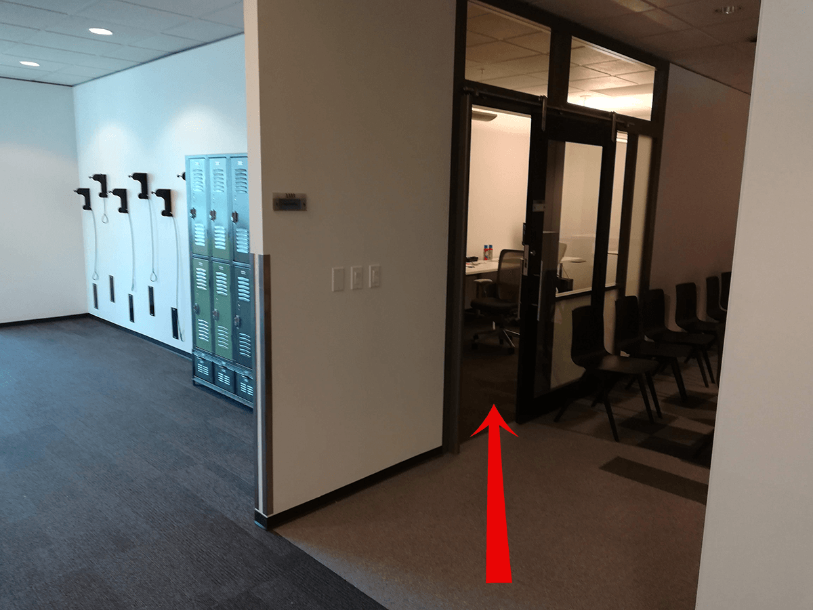
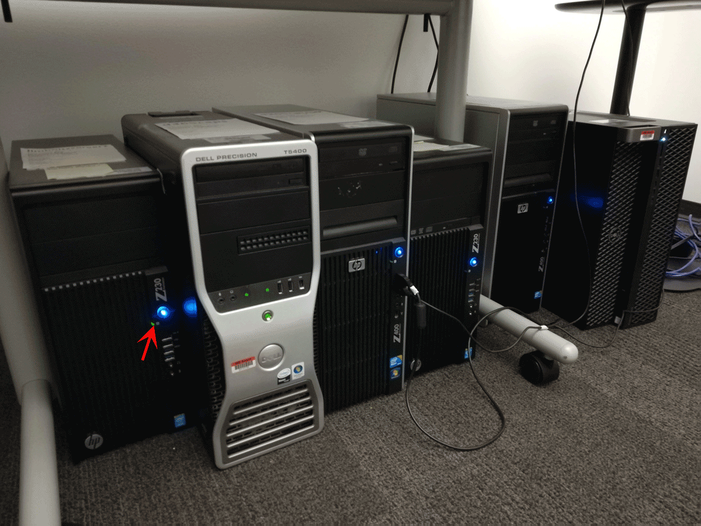
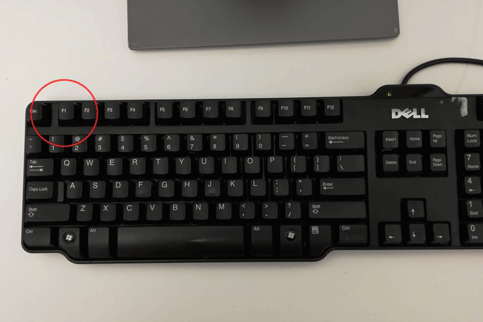
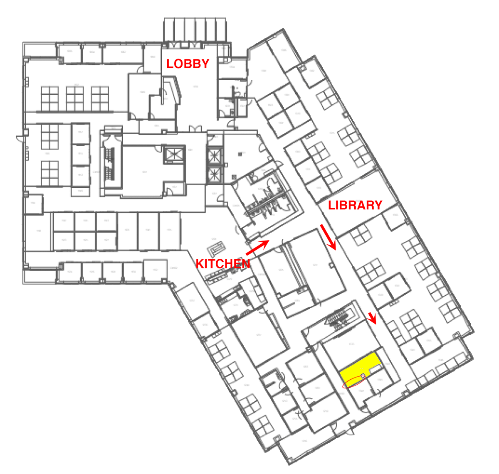

# BACX Server Location

BACX Servers are located in Advanta C / 1335. To find the room, follow these steps:

> 1. Go to the Galaga/Ms. PacMan machine near the kitchen.
> 2. Walk down the hallway toward the library.
> 3. Turn right at the library.

> [!div class="mx-imgBorder"] 
> 

> 4. Walk straight until you see room 1335 on your right.

> [!div class="mx-imgBorder"] 
> 
> [!div class="mx-imgBorder"] 
> 

> 5. The servers are under the desk at the far end of the room.

> [!div class="mx-imgBorder"] 
> 

> 6. Make sure all power lights are on. Turn on any machines without power lights

> [!div class="mx-imgBorder"] 
> 

> 7. Press the F1 key on the keyboard sitting on the table.

> [!div class="mx-imgBorder"] 
> 

## Map to the server room

> [!div class="mx-imgBorder"] 
> 
