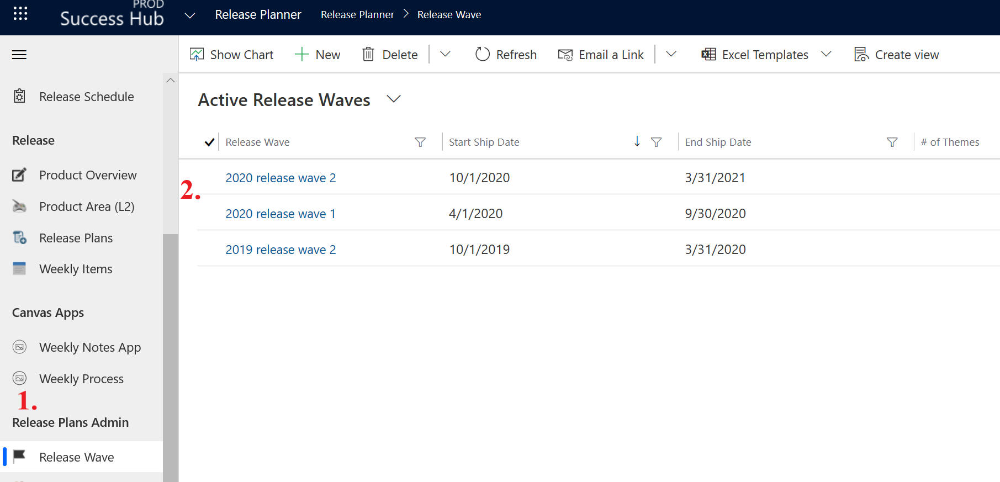
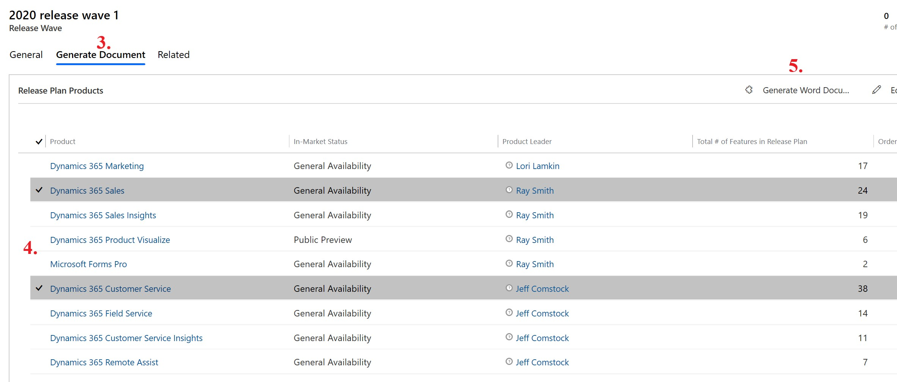
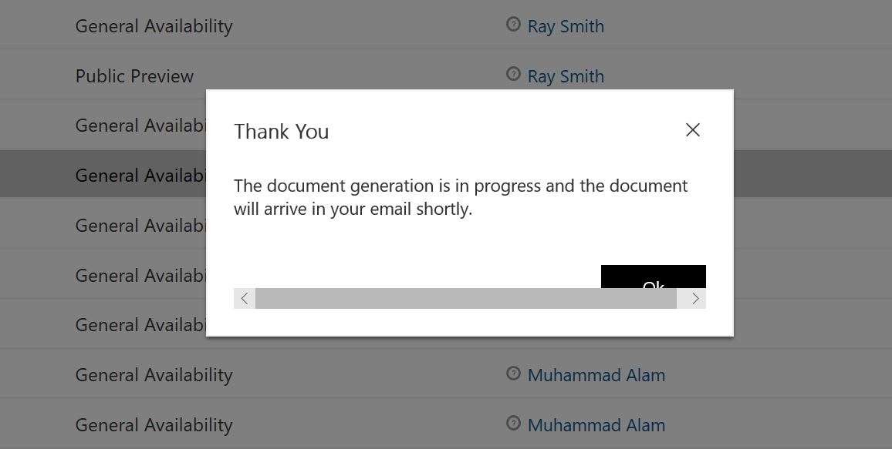
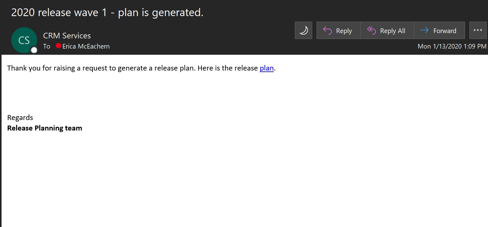

# Generate review document

You can now pull a review document from the release planner app. This will allow you to review your content when you wish instead of waiiting for the documents to go live on Docs or published as a PDF. Please note that this is a review copy only, so some of the formatting and images will not export perfectly. 

The process is simple:
1.	Go to the Release Wave in the left nav.
2.	Select the wave you wish to review (ex: 2020 wave 1).

3.	Select “Generate Document” on the top of the results box. 
4.	The products for that wave will appear. Select the products you wish you review. 
    (Note: Click to the left of the product name so that you see a check mark; you don't click the product name link.)
5.	Then click “Generate Word Document” on the right of the results box.  

A small popup will let you know that the document is being generated and will arrive in your mailbox. This is not immediate and is dependent upon how many products you select. 

In your inbox, you will get an email that looks like this: 

Click the “plan” link, and the Word document will download. It’s ready for your review. Remember, the email delivery time can vary depending on the size of the review document. 
