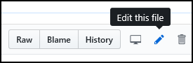
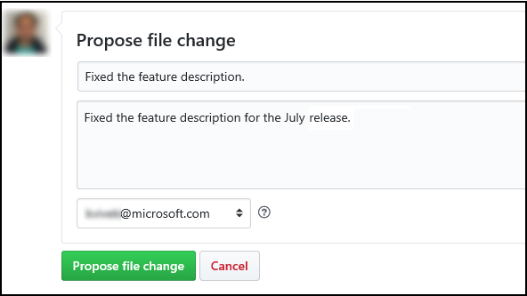

# Legacy: Fork our repo

> [!IMPORTANT]
> - This is an old/legacy process and should not be used anymore. Because we are enabling internal contributors and PMs with write access to our repos (see the earlier section about working directly in our repo), *there
is no need for you to fork our repos*.
> - **Benefits of working directly in our repo over forking**: You don't have to create a pull request to view you changes on the review site on docs. Committing a change in your branch (and pushing to server in case your have cloned the repo) provides you with a review link on docs where you can view your changes before creating a pull request to master, So, you must create branches and [work directly in our repos](work-repos.md) instead!

## Prerequisites

Complete steps 1 and 2 in the [Get started](get-started.md) topic. You don't need to request write access (step 3) to our repo to fork it.

## Making quick edits to a topic

1.  Identify the topic that you want to edit. For example:
    <https://docs.microsoft.com/en-us/powerapps/maker/index>

2.  Add **review** before **docs** in the URL to ensure that you are making
    changes to our internal (private) docs repo. For example, change the above
    URL to <https://review.docs.microsoft.com/en-us/powerapps/maker/index>

1.  Select **Edit** in the top-right corner of the topic to edit.      

    

2.  If you are not already signed in to your GitHub account, you will be
    prompted to sign in. After providing the GitHub credentials, and signing in,
    you will be taken to the source topic on GitHub.

3.  Select the pencil icon on GitHub to edit the topic.    

    

4.  You might see the following message stating that since you don’t have write
    access to the repo, GitHub has created a fork and a branch for you to submit
    your changes:  
    

    

5.  After making the required changes, scroll to the bottom of the page, type a
    title and description for your changes, and click **Propose file change**.  
    

    

6.  Next create a pull request from your newly created branch in your fork to
    the origin/master branch. If you want your changes to be merged and pushed
    live, ensure that you add **\#sign-off** in your PR comment. We will delete
    your branch in your fork after merging the PR and publishing it live.

>   More information about creating a PR: [Create a PR from a
>   Fork](https://help.github.com/articles/creating-a-pull-request-from-a-fork/).

## Making major or long-running changes

For a contributor who needs to make a major change or will be a frequent
contributor to a repository, he/she should fork the repo, clone it on his/her
local computer, and then make the updates.

For instructions, see [Set up Git repository locally for
documentation](https://review.docs.microsoft.com/en-us/help/contribute/contribute-get-started-setup-local?branch=master)

## Merge process for PRs: Forking model only

This is how we (Content Publishing team) will deal with the PRs created by
PMs/feature team using the Forking model to merge into the **master** branch and publish the content live.

1.  Any Pull Request (PR) created on a repo will automatically notify writers
    based on the **codeowners** info for the topic/folder in the repo.

2.  CPub reviewer will act on a PR *only if* **\#sign-off** is mentioned in the
    PR comment. This keyword is a trigger for CPub to review the changes, give
    feedback if appropriate, merge the PR into master, and push the changes
    live.

3.  After merging the PR into **master** and publishing live, the CPub
    owner/reviewer will delete the PM’s branch.

### Know more

[Concept: Fork a repo](https://help.github.com/articles/fork-a-repo/)
