# Make extensive changes to docs

If you want to make changes in multiple files and are aware of the file location
in [our GitHub repo](get-started.md#our-repos), you must *start
with creating a branch* in the repo, make all your changes, and then create a
pull request to merge all the changes your branch.

## Prerequisites

Ensure you have completed steps in [Get started](get-started.md).

## Create a branch

You must always create a branch before you start making changes to docs.

1.  Browse to one of [our repos](get-started.md#our-repos).

2.  Ensure that you are on the **master** branch; if not, select the **master**
    branch.  
    

    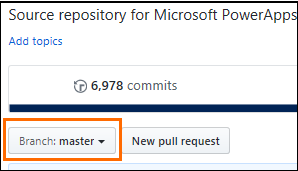

3.  Select the branch list, type a unique name for your branch, and press ENTER
    or select **Create branch**. You can have your Microsoft alias followed by
    the feature or work that you will be doing as your branch name so that it’s
    easier for you (and others) to identify the branch.  
    

    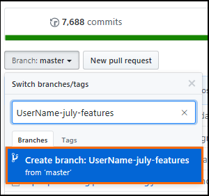

## Update multiple files

1.  Browse to one of [our repos](get-started.md#our-repos).

2.  Ensure that your branch is selected in the branch list before working on
    your changes. If you don’t already have a branch, first create a branch.  
    

    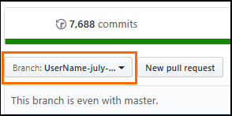

3.  Browse to the file that you want to change, and select the pencil icon to
    edit the topic:  
    

    

4.  After changing the file, commit *directly* to your branch.  
    

    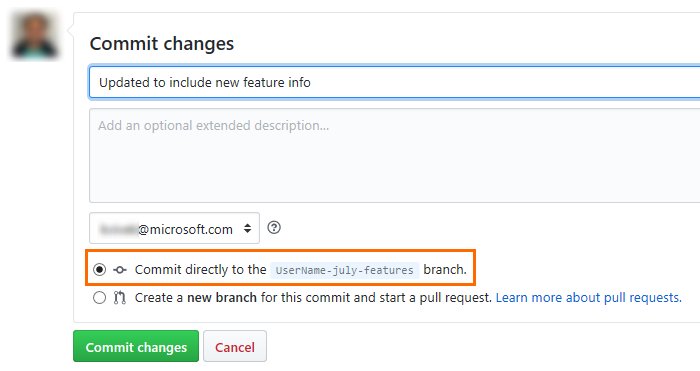

5.  Browse to another file, make changes, and commit to your branch. Repeat
    until you are done with your changes.

    Every time you commit a change, the files will be built, and you will get a
review link on docs in your email with your recent changes that you can review.

6. When your changes are ready to be published live, create a pull request as described later in this topic.

## Create a file

1.  Browse to one of [our repos](get-started.md#our-repos).

2.  Ensure that your branch is selected in the branch list before working on
    your changes. If you don’t already have a branch, first [create a branch](#create-a-branch).  
    

    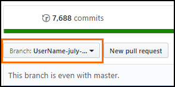

3.  Browse to the folder/location where you want to create a file, and then
    select **Create new file**.  
    

    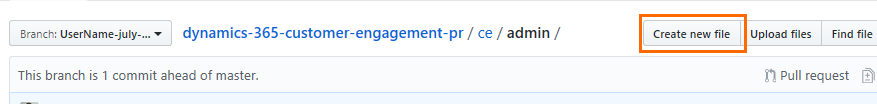

4.  Specify a name for your file, and press ENTER. For example,
    my-first-file.md.  
    

    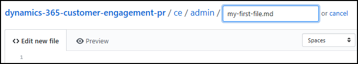

5.  Make changes in your file, and then commit directly in your branch to create
    the file.  
    

    

6.  When your changes are ready to publish live, create a pull request as described
    later in this topic.

## Upload images

1.  Browse to one of [our repos](get-started.md#our-repos).

2.  Ensure that your branch is selected in the branch list before working on
    your changes. If you don’t already have a branch, first [create a branch](#create-a-branch). 

    

3.  Capture/create your screen shot, and save it as a .png file on your
    computer. No spaces in the file names; use hyphens and all lowercase letters. For example: **work-with-views.png**.

4.  Navigate to the **media** folder under the topic folder where you want to
    add the image.

5.  Select **Upload files**, and then select **choose your files**.  
    

    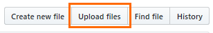

6.  Browse on your computer to select the image file. You can select multiple
    files, if required.

7.  After selecting the required image files, commit the changes directly to
    your branch.  
    

    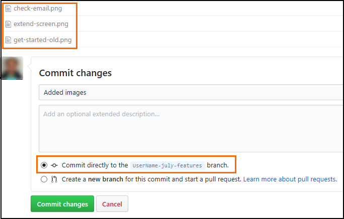

8.  When your changes are ready to publish live, create a pull request as described
    later in this topic.

## Rename a file

> [!CAUTION]
> Renaming a file will lead to broken links. Also, if the file is
aready published live, a redirect must be set to route users from the original URL to the new URL. Please work with your CPub contact before renaming a file to understand the implications, and address them.

1.  Browse to one of [our repos](get-started.md#our-repos)

2.  Ensure that your branch is selected in the branch list before working on
    your changes. If you don’t already have a branch, first [create a branch](#create-a-branch).

    

3.  Browse to the file that you want to rename, and select the pencil icon to
    edit the topic:  
    

    

4.  Instead of editing the contents, change the file name at the top:  
    

    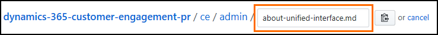

5.  Commit the change directly to your branch.

6.  When your changes are ready to publish live, create a pull request as described
    later in this topic.

## Delete a file

> [!CAUTION]
> Deleting a file will lead to broken links from other topics or TOC. Also, if the file is
aready published live, a redirect must be set to route users from the original URL to the new URL. Please work with your CPub contact before deleting a file to understand the implications, and address them.

1.  Browse to one of [our repos](get-started.md#our-repos)

2.  Ensure that your branch is selected in the branch list before working on
    your changes. If you don’t already have a branch, first [create a branch](#create-a-branch).

    

3.  Browse to the file that you want to delete, and select the delete icon:  
    

    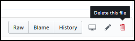

4.  Commit directly in your branch to delete the file.

5.  When your changes are ready to ship, create a pull request as described
    later in this topic.

## Finally: Create pull request to merge your changes and publish live

1.  Browse to one of [our repos](get-started.md#our-repos)

2.  Ensure that your branch is selected in the branch list. Select **New pull
    request**. 

    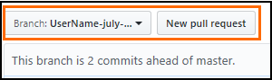

3.  Ensure that the **master** branch is on the left and your branch on the
    right before you create a pull request. Type a pull request title and select
    **Create pull request**.    

    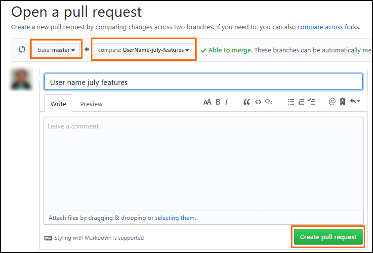

Thats it! A writer will pick up your PR, merge it into the master branch, and publish live. After merging your PR, the writer will delete your branch to avoid branch clutter in our repo.

> [!NOTE]
> Any **stale** branches (branches with no active pull requests and no activity for 8 weeks) will be deleted from our repo. If you have a special situation, please contact [crmce](mailto:crmce@microsoft.com).