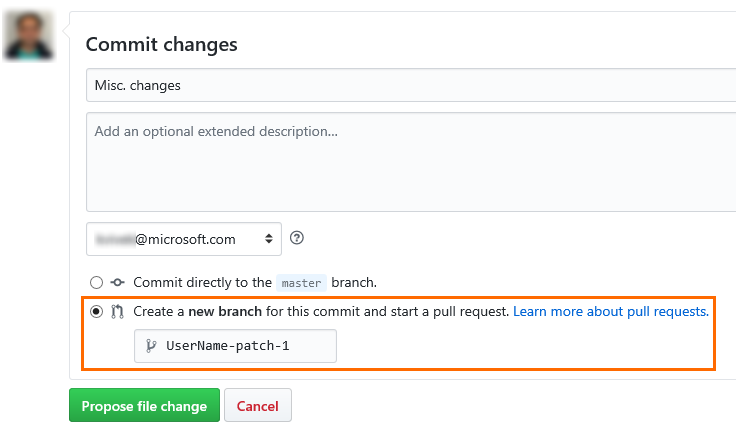

# Make quick edits to a topic

This is helpful if you are looking to make quick edits to a topic, and don't want to spend time finding the topic in our GitHub repo. Also, this does not require you to install any tools on your PC; all the work can be done using the browser! 

1.  Identify the topic that you want to edit on the docs site. For example:
    <https://docs.microsoft.com/en-us/powerapps/maker/index>

2.  Add **review** before **docs** in the URL to ensure that you are making
    changes to the internal (private) docs repo. For example, change the above
    URL to <https://review.docs.microsoft.com/en-us/powerapps/maker/index>

3.  Select **Edit** in the top-right corner of the topic to edit.  
    

    

4.  If you are not already signed in to your GitHub account, you will be
    prompted to sign in. After providing the GitHub credentials, and signing in,
    you will be taken to the source topic on GitHub.

5.  Select the pencil icon on GitHub to edit the topic:  
    

    

6.  After making the required changes, scroll to the bottom of the page, type a
    title and description for your changes, *select to create a new branch*, and
    click **Propose file change**.     

    

7.  Next, create a pull request from
    your newly created branch to the **master** branch.

8.  Thats it! A writer will pick up your PR, merge it into the master branch, and publish live. After merging your PR, the writer will delete your branch to avoid branch clutter in our repo.

> [!NOTE]
> Any **stale** branches (branches with no active pull requests and no activity for 8 weeks) will be deleted from our repo. If you have a special situation, please contact [crmce](mailto:crmce@microsoft.com).