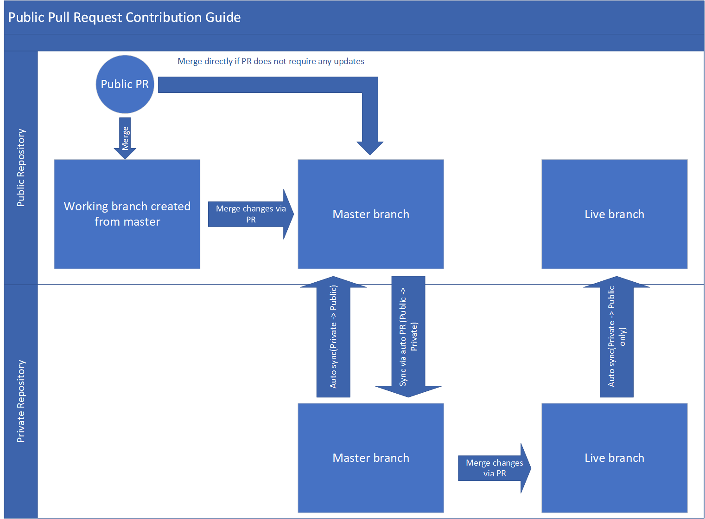

# Introduction

We have made our Customer-Engagement repository public. This results in having two different repository which are

	- **[Private repository](https://github.com/MicrosoftDocs/dynamics-365-customer-engagement-pr):** This repository will always be the main working repository for us.

	- **[Public repository]( https://github.com/MicrosoftDocs/dynamics-365-customer-engagement):** This repository is meant to receive **customer/public feedback** through the new feedback feature (which replaces LiveFyre). It helps to receive suggested changes through Pull-Requests/issues created by the customers/public.

> [!IMPORTANT]
> - The public repository exposes Live and Master branch to the outside world and an automatically created sync branch (repo_sync_working_branch). All these branches in any point of time contains content which are already published/released or is ready to be published.

> - In our private repository, both Master and Live branch are always in sync with each other and we no longer support staging branch.

> - An auto assignment tool keeps polling the public repository for any new Pull-Request and assign it to the relevant contributors based on the changed files in the Pull-Request. The Pull-Request is assigned to the authors who owns the areas to which the changed files belong.

## Syncing configurations in OPS for private and public customer-engagement repository

- ### Syncing from private to public repository
	
	- The **master** and **live** branch are configured in OPS to **sync** automatically **from private to public repository**. 

	- If any conflicts occurs while auto syncing, OPS **creates a Pull-Request** in public repository which has to be resolved and merged manually. (Content-Engineering team will take care this)
	
- ### Syncing from public to private repository
	
	- The **master** branch is configured in OPS to **sync** from **public to private repository** via an automatically created Pull-Request. 

	- The changes in master branch from public repository to private repository is merged via this Pull-Request.

## Guide to accept changes from a customer Pull-Request in public repository

- For any new Pull-Requests created or existing Pull-Requests which **targets master** as base branch, there are two approaches the Pull-Request can be merged and resolved.

	- #### If the customer Pull-Request doesn’t require any changes and is perfect:

		- merge the pull-request directly into the master branch.
	
	- #### If the customer Pull-Request requires some changes before it can be merged: 

		- Create a working branch in public repository from master branch in GitHub
		
		- Edit the assigned Pull-Request to have the base branch selected to your newly created branch instead of the actual base branch(live or master). Check below steps for reference:

			- Select the **Edit** button next to Pull-Request title.

				
		
			- Change the **base** branch from the select menu to your working branch.

				

			- Select **Change base** and the base branch will be updated.

				

		- Merge the assigned Pull-Request into your working branch. Do relevant changes as necessary for finalizing the content.
		
		- Create a new Pull-Request from your working branch for the master branch in public repository and merge it into master.

- The OPS is configured to immediately create a Pull-Request in the private repository for moving changes from master branch of public repository once any changes is merged in public repository master branch. Review this Pull-Request and get it merged into the master branch of the private repository.
		
- Once the changes are merged into private repository master branch, the final step is to create a publish task for pushing the changes from master into Live (The usual process to push contents live in private repository).

- The pushed changes in Live branch will get automatically synced in public repository from private repository.

> [!IMPORTANT]
> For any existing Pull-Requests (which are very few in numbers) which targets Live as base branch, we need to manually copy over the changes in private repository and get them published and then close the Pull-Request in public repository.

> [!NOTE]
> **The Content Engineering team will work on improving the process further based on feedbacks received.**