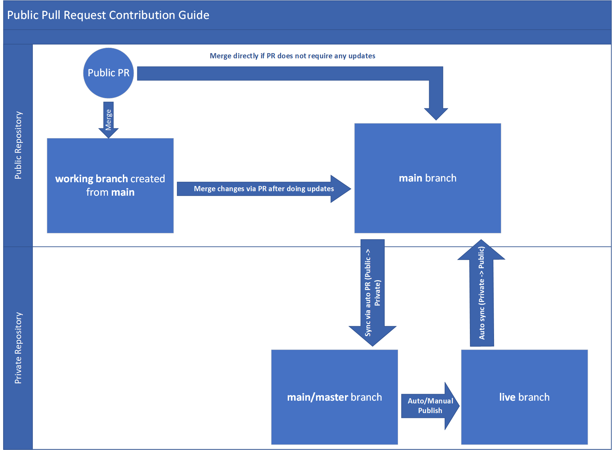
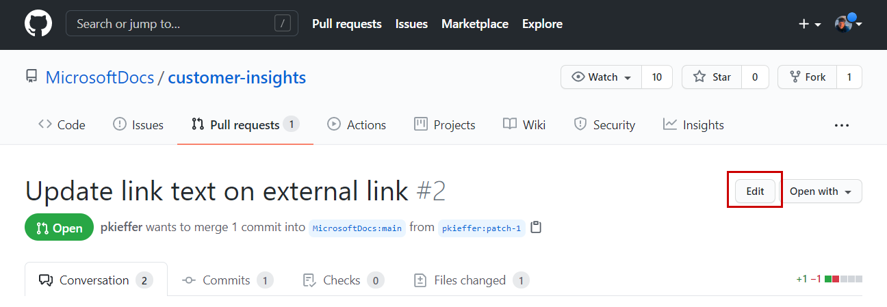
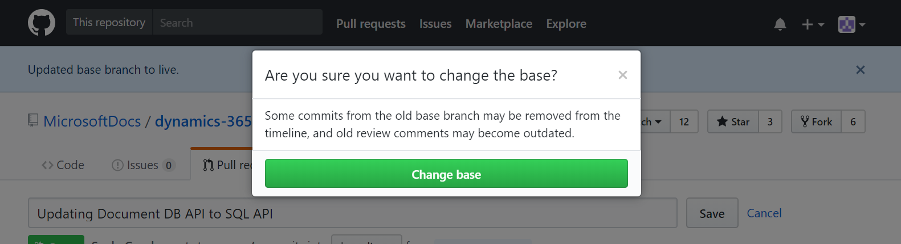

# Public Pull-Request Contribution Guide

We have configured public contribution for our Docs repositories. This enables the customer/public to share their feedback regarding a Docs topic by creating GitHub issues in public repository or suggest modification to a Docs topic by submitting a pull-request with content updates. In this topic, we explain how the private-public repository sync works and what are the steps required to incorporate suggested changes through a public pull-request submitted by a customer.

> [!NOTE]
>
> - **Private Repository:** The working repository for internal contributors (writers/PMs) who have joined [Microsoft Docs](https://github.com/MicrosoftDocs) organization on GitHub. Private repositories are accessible by Microsoft Docs members only.
> - **Public Repository:** The repository for receiving external feedback from customer/public through the Docs feedback feature. It helps to receive suggested changes through Pull-Requests/issues created by the customers/public.
> - The public repository exposes the default **main** branch to the external contributors. Another branch which exists is a sync branch (repo_sync_working_branch) and is used as staging branch by OPS auto sync configurations for syncing content between private-public repository pairs. All branches in public repository contains content which are already published.
> - An auto assignment tool keeps polling the public repository for any new GitHub issue or pull-request and assign these to the contributors based on the topic's author/configured assignees.
> - For a list of private-public repository pairs maintained by us, please visit: **[Private-Public repository pairs](http://bacx0-web/repos/?type=public)** (Note: you must be connected to VPN/Corpnet to access the link).

## Syncing configuration in OPS for private and public repository pair

- ### Syncing from private to public repository
	
	- The private repository's **live** branch is configured to sync automatically to public repository's **main** branch.

	- If there is a conflict between private-public repository pair, OPS creates a pull-request in public repository which needs to be resolved and merged manually for sync to complete.
	
- ### Syncing from public to private repository
	
	- The public repository's **main** branch is configured to sync to private repository's **main/master** branch via pull-request.

	- For the sync to complete from public to private repository, the pull-request which is created automatically in the private repository needs to be merged. The pull-request can be identified with the title that starts with the text *"Confirm merge from repo_sync_working_branch..."*.

## Guide to accept changes from external contributor's pull-request submitted in public repository

- **Step 1:** For any external pull-request in public repository which targets **main** as base branch, there are two approaches to merge the content.

	- #### If the external pull-request doesn’t require any changes and is completely fine:

		- merge the pull-request directly into the main branch of public repository.
	
	- #### If the external pull-request requires some changes before it can be merged: 

		- Create a working branch in public repository from main branch in GitHub
		
		- Edit the pull-request to have the base branch selected to your created working branch. Refer to the steps below:

			- Select the **Edit** button next to pull-request title.

				
		
			- Change the **base** branch from the select menu to your working branch.

				

			- Select **Change base** and the base branch will be updated.

				

		- Merge the pull-request into your working branch. Perform requisite updates as necessary for finalizing the content.
		
		- Create a new pull-request from your working branch to the main branch and merge.

- **Step 2 (Important):** The public-private repository sync is configured to automatically create a pull-request in the private repository for syncing changes from main branch of public repository once a pull-request is merged in public repository. It is mandatory to review this auto-created pull-request and merge into the master/main branch of the private repository.
		
- **Step 3:** Once the changes are merged into private repository main/master branch, the external contribution changes will eventually  be published live through auto-publish cycle or manually through a publish request.