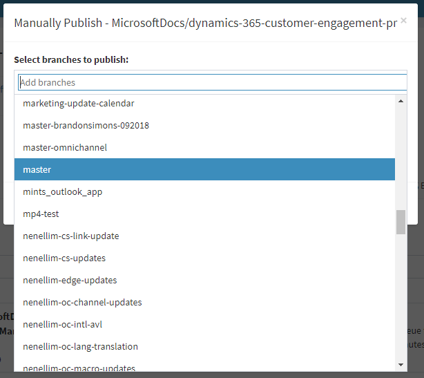
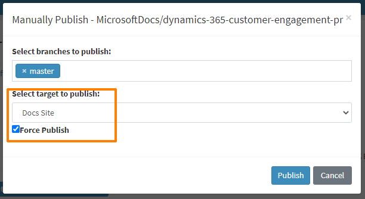
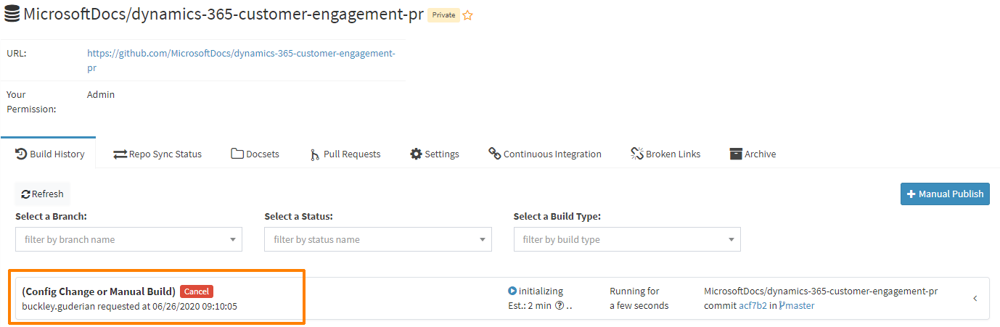

# Request a manual doc build

Often, docs build failures can be fixed by requesting a manual content build. To make a request:

1. Browse to <https://ops.microsoft.com>.
2. Select **Sign in with GitHub**.
3. Provide your GitHub credentials to sign in.
4. In the OPS Portal, type the repo name where you made the change in the upper left corner. You can find the repo names here: [our repos](get-started.md#our-repos).
    
    For example, if the repo URL is https://github.com/MicrosoftDocs/dynamics-365-customer-engagement-pr, then your repo name is **dynamics-365-customer-engagement-pr** 

    :::image type="content" source="media/manual-publish-step-1.png" alt-text="Search for repo in the OPS portal.":::

5. Select the repo name from the list below that exactly matches the name you typed, and then select the **Build history** tab.

    :::image type="content" source="media/manual-publish-step-2.png" alt-text="Build history tab":::

6. Click **+ Manual Publish**

    :::image type="content" source="media/manual-publish-step-3.png" alt-text="Manual publish button" border="false":::

7. Enter the name of the branch to build.

    

8. Select **Docs Site** as the target to publish, ensure that **Force Publish** is selected, and click **Publish**.

    

9. After a refresh, note that your manual build is added to the queue.

    

