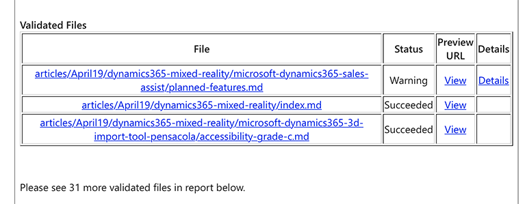
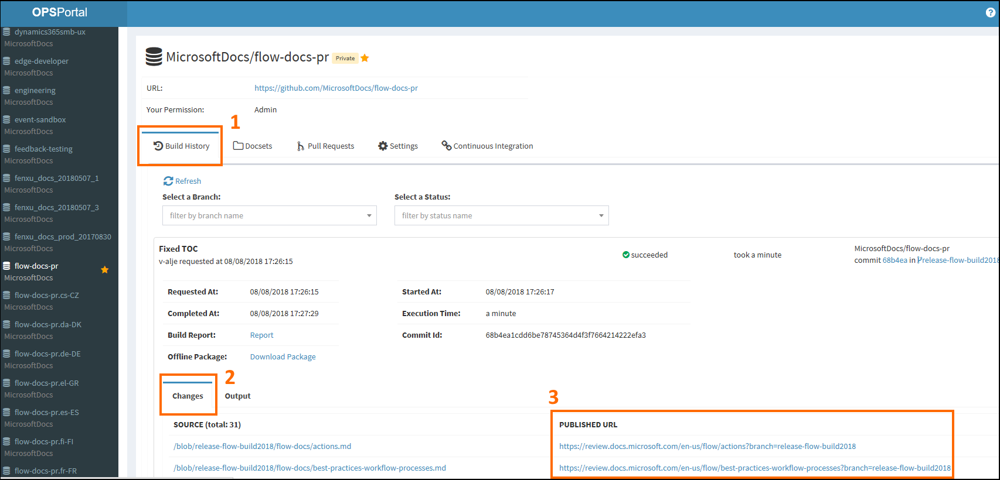
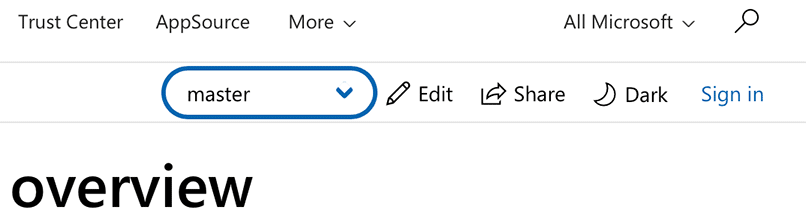

# Review links

There are multiple ways to find review links to content in your branches.

Each time you commit a change, the build system ("OPS") generates a build, and provides review links. You can find these in build status emails, or on the OPS build portal. You can also navigate between branches on the review site to find your content.

## OPS build email

 When a build completes (or fails), the OPS system sends a status email message. The subject line for these messages will be similar to **[Succeeded With Warning] Open Publishing Build Service - Publish**. The text in the brackets can be "Succeeded", "Succeeded With Warning", or "Failed". These messages contain review links for pages that were successfully built.

 > [!div class="mx-imgBorder"]
 > 

Click **View** to navigate to a review build of a particular page. To find links for all topics included in a build, click **Open Publishing Publish Report** near the end of the build status email.

If you aren't receiving build status emails, check your GitHub notification settings.

 1. Navigate to <https://github.com/settings/notifications>. You may need to log     in to GitHub.

 2. Under **Email notification perferences**, verify the email address in     **Default notification email**, and make sure **Include your own updates**  is checked.

Also check your Outlook rules to make sure the messages aren't being blocked.

## OPS build portal

The OPS build portal gives an overview of OPS builds. To see the status of your build, and access review links:

 1. Navigate to [http://ops](http://ops) and sign in.

 2. Find your repo by either scrolling in the left pane, or using the search box. Select it.

 > [!NOTE]
 > To make it easier to find your report in the future, you can either click the star icon to add a particular repo to your list of favorites, or bookmark the page URL.

 3. Depending on the type of report, you may need to click either the **Build History** or **Builds** tab.

 4. Scroll down to find the build for your commit.

 5. Once the build is completed, click to expand.

 6. Scroll down for review links. You can also click **Report** to see the build report.

 > [!div class="mx-imgBorder"]
 > 

## Navigating the review site

Most of the time, you can use your browser to navigate to your review content.

 1. Navigate to a live topic in your docset (if possible, find the topic you'd like to review). For example [https://docs.microsoft.com/en-us/business-applications-release-notes/October18/index](https://docs.microsoft.com/en-us/business-applications-release-notes/October18/index).

 2. Prepend **review** to the topic URL. For example [https://**review**.docs.microsoft.com/en-us/business-applications-release-notes/October18/index](https://review.docs.microsoft.com/en-us/business-applications-release-notes/October18/index).

 3. Use the branch dropdown to select your branch.

 >[!div class="mx-imgBorder"]
 >

 > [!NOTE]
 > You can also edit the URL. Set the **branch=** parameter to your branch name.

 4.  If necessary, use the TOC to navigate to your topic.

