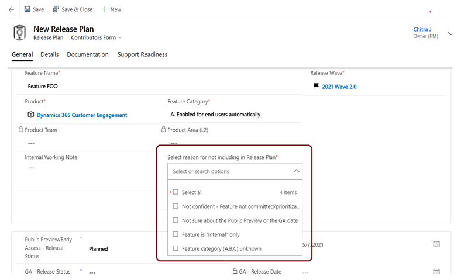

# Additional Capabilities

 **Not included in the Release Plan reason**

**Persona:** Product Marketing Group (PMG) & Engineering PMs

**Why this feature:**
We have introduced a field to capture the reason why a release plan is saved with “Include in Release Plan” value as “No.” When that toggle is set to “No,” then a dropdown appears and PMs is required to select a reason which gives us more visibility as to why these features are not going external. 

$git config--global color.ui auto
