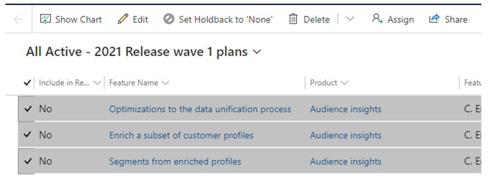

# Feature: Holdback plans

**Persona:** Product Marketing Group (PMG) & Content Publishing Team

**Why this feature:**

The Product Marketing team did not have the ability to hold back a release plan within the release planner app. PMs were asked to set “Include in Release Plan” to No to stop features from publishing which introduced risk. If someone accidentally sets the “Include in Release Plan” to Yes, the plan could potentially be published in the next publishing cycle. In order to help this situation, we have introduced a holdback feature which appears as an editable field in the marketer’s form and as read-only in the contributor’s form.

**How does it work:**
-	This feature allows the PMM to associate a release plan to a marketing or newsworthy moment. 
-	Once the feature is set as holdback, it will not be pushed into GitHub to continue the publishing cycle until at least after the disclosure date of the marketing moment has passed.
If something is a Category A feature, Feature Scope = Internal or already published feature is not allowed to set the holdback type = “Newsworthy”. PMG can set either “none” or “monetizable”. These two types don’t keep the release plan held for any moment and will be published as per the schedule.

If a product is set for a marketing moment disclosure, all the unpublished release plans of that product are set automatically for that marketing moment regardless of the holdback type. 

For example: “Product A” is set for the Inspire 2021 moment disclosure, all the plans associated with Product A that are not published yet will be automatically set for the Inspire 2021 moment and will not be published till that moment.

PMG can quickly set multiple plans to holdback type “None” by selecting the plans and click the button “Set Holdback to None”

