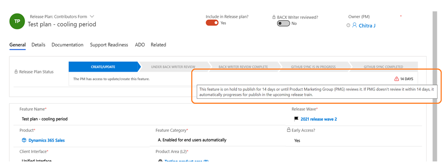

# Feature: Cooling period

**Persona:** Product Marketing Group (PMG)

**Why this feature:**

When a new plan is created, it gets picked up for publication without allowing time for the Marketing team to review and set holdbacks.

**What will it solve:**

This holds the plan out of the publishing queue for 14 calendar days or until the PMG has reviewed it and sets a holdback. 

**How does it work:**

1.	Whenever a new plan is created either for current or past waves, an countdown alert will show up in the release plan (see screenshot below), and an email notification will be sent to the Product Marketing team prompting them to review the feature.
2.	PMG will set the holdback type within 14 calendar days. During this cooling period, plans will not be picked up in the GitHub PR generation for the next publication.
3.	However, if the PMG reviews and sets a holdback type within 14 days, the alert notification disappears, and the plan will be picked up for the next PR pull. If the feature is not reviewed within 14 days, it will be picked up for next train regardless if the holdback is set or not.

