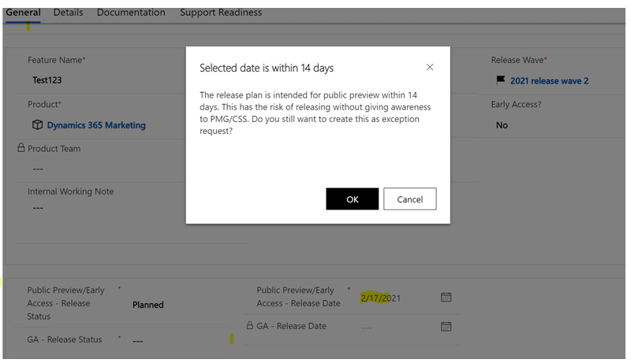

# Feature: Public Preview exception

**Persona:** Product Marketing Group (PMG) & Support Readiness

**Why this feature:**

Notifying the downstream partners on newsworthy or monetizable feature 

**What will it solve:**

This feature was created to help the Product Marketing and the Support Readiness team identify newsworthy or monetizable features recently added in the release planner app, and to prepare for the support readiness work. There are instances where teams create release plans closer to the public preview date making it challenging for the dependent teams such as Product Marketing and Customer support teams to move ahead with their workstreams. By introducing this feature, we now can categorize these newly added features as “exceptions” and notify the Product Marketing and Support readiness team. 

**How does it work:**

-	The Public Preview exception feature shows an alert message (screenshot below) whenever a new release plan is created with Public Preview status set as ‘Planned’ and has a date set within 14 days. 
-	Once the engineering PMs acknowledge the alert notification, these features will be marked as exceptions in the release planner app (backend). 
-	An email alert goes out to the Product Marketing and to the Support Readiness team with a list of release plans that are under ‘exceptions’  so they can act on them. 

=======
# Feature: Public Preview exception 

