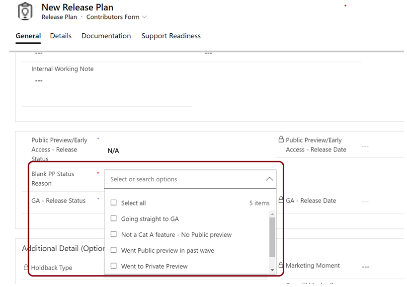

# Reason for Public Preview when set to blank or NA

**Persona:** Product Marketing Group (PMG) & Engineering PMs

**Why this feature:**
Public preview is a key milestone that is closely tracked by the internal teams such as Support and Product Marketing in preparation for support training, support readiness, and for preparing for any marketing moments. Adding this drop down helps our internal stakeholders to understand when the feature is first available in the market. 

