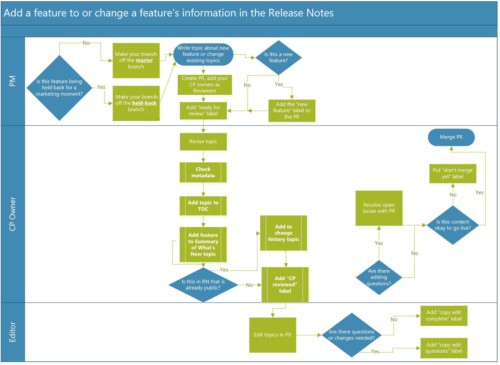

# Authoring process

Our **wave 2** release plans are created and updated in the Release Planner Tool and edited in GitHub. **April '19** release notes are created, updated, and edited in GitHub. *You'll need to be familiar with both.*

## Release Planner Tool

<!--Should they be called PMs, writers, or doc owners? -->

To create or update release plans for wave 2 or later, **PMs** should work in the [Release Planner Tool](https://aka.ms/bagreleasenotes). 

For guidance on using the tool, see these resources (available under Resources in the left navigation pane of the tool):
- [BAG Release Planner App Guide](https://microsoft.sharepoint.com/:w:/t/ProjectBahnhof/EYBGZgE9Js5CioBE2LAIjSwBCgn_hvM9QtZ7gPimS85vkQ?rtime=RWW9laMl10g) 

- [Demo video](https://msit.microsoftstream.com/video/c78b4dec-e4c3-4cd9-b827-c6535c11757a?list=studio)

## GitHub

To create a GitHub account and join our org, read the [Contributors Guide](contributors-guide.md), in particular [Get started](get-started.md) and [Work directly in our repos](work-repos.md).

For **PMs** still working on April '19 content: A best practice is to create your own branch off of the working branch (master), and then make all your changes to it for the feature or features you are working on. For example, if you update the description and target release date for a feature, you would create a branch, make your changes, and then create a pull request (PR) to merge the updates into the master branch. 

**Editors** will review pull requests in GitHub. If they have questions about the content, they'll contact the Doc owner in email. Otherwise, they'll approve and merge the pull requests into the master branch, where it will go live with the next publish. 

**Warning:** Once a PR is merged into master, it can go live at any time. Never submit a PR until you are sure the information about the feature is ready to be public knowledge. 

<!--this needs updating:

 
 -->

