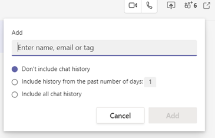

# Add your non-Microsoft alias to Teams chats

You can continue to participate in ongoing Teams chats by adding your new alias. You can do this during the transition period when you still have network access. Otherwise, ask your manager to add your alias.

1.	Open a Teams chat, select **View and add participants** in the upper right, and then select **Add people**.

> 
 
2.	Enter the full alias you want to add and make a chat history selection. Then select **Add**.  

> 
